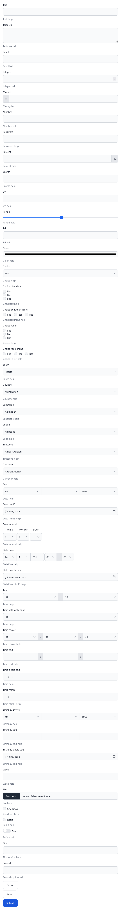
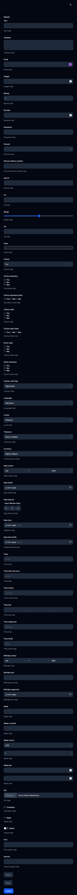
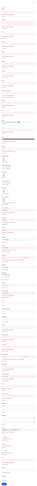
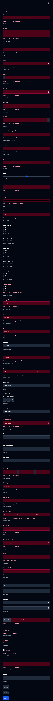

# Flowbite bundle

This bundle provide a Symfony form theme for [Flowbite](https://flowbite.com/).

## Documentation

The bulk of the documentation is stored in the [`docs`](docs/index.md) directory of this bundle:

* [Getting started](docs/index.md#getting-started)
    * [Prerequisites](docs/index.md#prerequisites)
    * [Installation](docs/index.md#installation)
    * [Configuration](docs/index.md#configuration)
* [Theme customization](docs/theme_customization.md#theme-customization)
    * [Overriding CSS classes](docs/theme_customization.md#overriding-css-classes)
    * [Class block list](docs/theme_customization.md#class-block-list)
* [Custom Form Types](docs/custom_form_types.md#custom-form-types)
    * [SwitchType](docs/custom_form_types.md#switchtype)

## Screenshots

| Default theme                                        | Dark theme                                        |
|------------------------------------------------------|---------------------------------------------------|
|        |        |
|  |  |

## Credits

* [Romain Monteil](https://github.com/ker0x)
* [All contributors](https://github.com/talesfromadev/flowbite-bundle/graphs/contributors)

## License

This bundle is under the MIT license.  
For the whole copyright, see the [LICENSE](LICENSE) file distributed with this source code.
